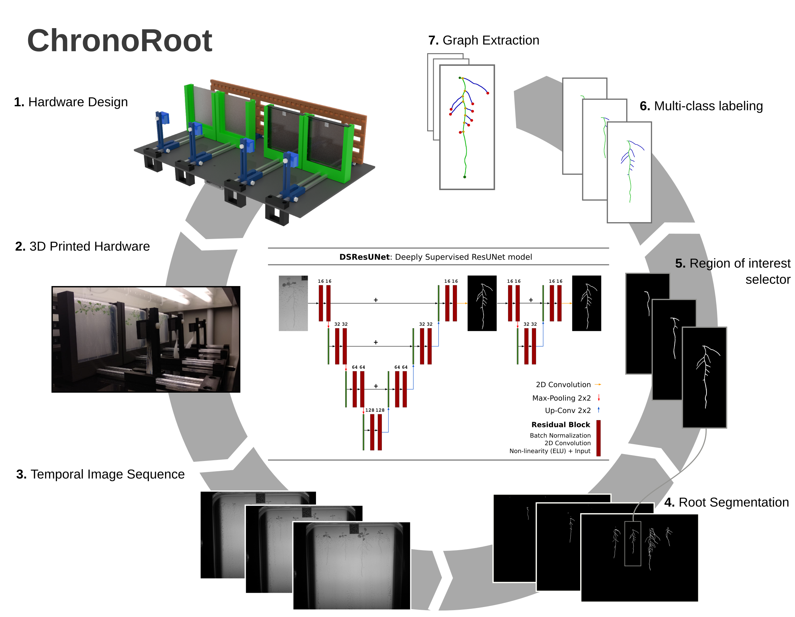

# ChronoRoot: High-throughput phenotyping by deep learning reveals novel temporal parameters of plant root system architecture

Nicolás Gaggion¹, Federico Ariel², Vladimir Daric³, Éric Lambert³, Simon Legendre³, Thomas Roulé³, Alejandra Camoirano², Diego Milone¹, Martin Crespi³, Thomas Blein³, Enzo Ferrante¹

¹ Research Institute for Signals, Systems and Computational Intelligence (sinc(i)), FICH-UNL, CONICET, Ciudad Universitaria UNL, Santa Fe, Argentina.\
² Instituto de Agrobiotecnología del Litoral (IAL), CONICET, FBCB, Universidad Nacional del Litoral, Colectora Ruta Nacional 168 km 0, Santa Fe, Argentina.\
³ Institute of Plant Sciences Paris-Saclay (IPS2), CNRS, INRA, University Paris-Saclay and University of Paris Bâtiment 630, 91192 Gif sur Yvette, France.

# ChronoRoot Module Controler

A web interface to control the the ChronoRoot module designed
for image-based plant phenotyping.

## ChronoRoot module description

The ChronoRoot device is an affordable and modular imaging system based on 3D-printed
and laser cut pieces and off-the-shelf electronics. Each module consists of a
Raspberry Pi (v3)-embedded computer controlling four fixed-zoom and fixed-focus cameras
(RaspiCam v2), and an array of infrared (IR) LED back-light. In between each camera
and the corresponding IR array, there is a vertical 12 x 12 cm plate for seedling
growth, allowing automatic image acquisition repeatedly along the experiment without any
modification or movement of the imaging setup. The four-plate module is small
(62 x 36 x 20 cm) and can be placed in any growth chamber. The different parts of
the imaging setup (back-light, plate support and camera) can be positioned along
a horizontal double-rail to control the field of view of the camera and accurate lightning.
In addition, the camera can be moved vertically. ChronoRoot allows image
acquisition at a high temporal resolution (a set of pictures every minute). The
use of an IR back-light (850 nm) and optional long pass IR filters (> 830 nm)
allow acquiring images of the same quality independently from the light conditions
required for the experiment, during day and night.

Each module is connected to the network either by Wi-Fi or Ethernet cable. A web
interface allows the control of the device offering live feed of the cameras for
field of view and focus setup. The user can program the activation of cameras and
IR back-light, starting and ending dates, the time basis for picture acquisition,
and finally follow the progression of the experiment. The pictures are saved
directly on an external drive plugged on the Raspberry Pi. Once the experimental
setup is ready, each module is completely independent from the external
environment and the access to the network.

## ChronoRoot module controler documentation

  * [About](app/doc/about.md)
  * [ChronoRoot App installation](app/doc/install.md)
  * [App architecture](app/doc/dev_doc.md)
  
# Image analysis

Software for image analysis in the [ChronoRoot repository](https://github.com/ngaggion/ChronoRoot/)
